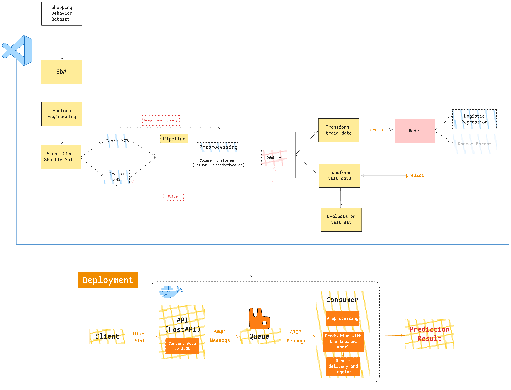
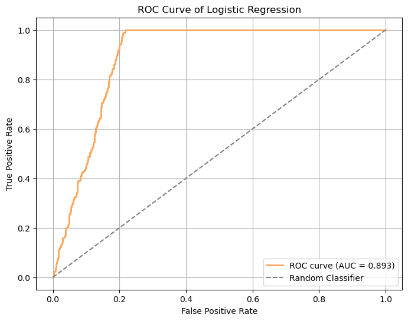
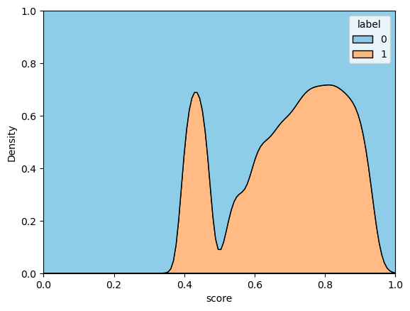
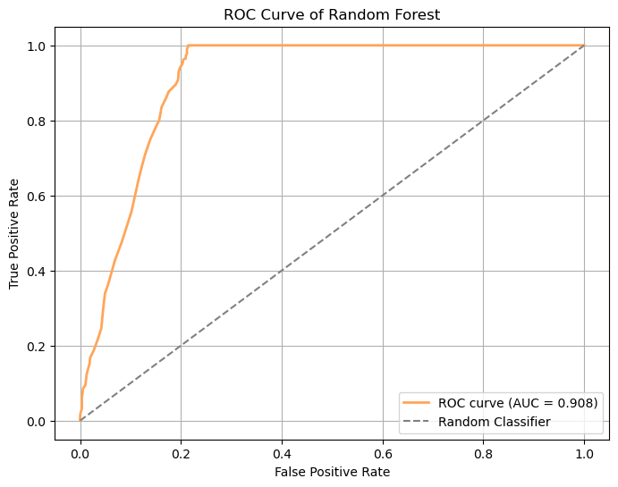
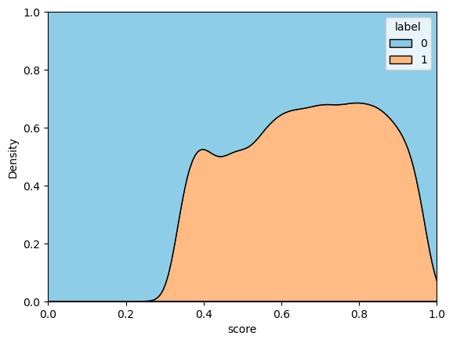
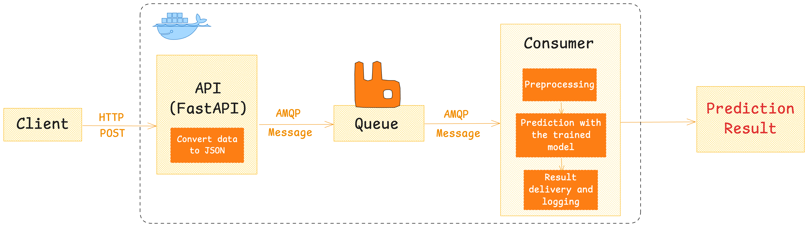

# 🛍️ Customer Subscription Prediction

- Content:
  - [Introduction](#introduction)  
  - [Data Dictionary](#data-dictionary)  
  - [Implementation Steps](#implementation-steps)  
    - [Import Libraries](#import-libraries)  
    - [Exploratory Data Analysis (EDA)](#exploratory-data-analysis-eda)    
    - [Split Data](#split-data)
    - [Pipeline](#pipeline)
    - [Model](#model)
<<<<<<< HEAD
    - [Cross Validation](#cross-validation)

**Disclaimer:** This is a demo project. I will continue to update it until the final product brings the best possible results.


=======
    - [Overfitting/Underfitting](#overfittingunderfitting)
    - [Population Stability Index (PSI)](#population-stability-index-psi)
    - [Cross Validation](#cross-validation)


>>>>>>> dev

# Introduction

Based on the [Consumer Behavior and Shopping Habits](https://www.kaggle.com/datasets/zeesolver/consumer-behavior-and-shopping-habits-dataset/data) dataset from Kaggle, this project analyzes customer behavior to classify and predict whether a customer has opted in for a subscription service. The goal is to assess customer loyalty and estimate the potential for recurring revenue.

# Data Dictionary

| Variable Name               | Role     | Type        | Description                                                                                                                                             |
|-----------------------------|----------|-------------|---------------------------------------------------------------------------------------------------------------------------------------------------------|
| Customer_ID                 | Feature  | Integer     | Unique identifier for each customer, enabling tracking and analysis of their shopping behavior over time.                                               |
| Age                         | Feature  | Integer     | The customer’s age, providing demographic information for segmentation and targeted marketing.                                                         |
| Gender                      | Feature  | Categorical | The customer’s gender, a key demographic factor influencing product preferences and purchasing patterns.                                                |
| Item_Purchased              | Feature  | Categorical | The specific item chosen by the customer during the transaction.                                                                                        |
| Category                    | Feature  | Categorical | The broad group to which the purchased item belongs (e.g., clothing, electronics, groceries).                                                           |
| Purchase_Amount_USD         | Feature  | Integer     | The transaction’s monetary value in U.S. dollars, indicating the cost of the purchased item(s).                                                         |
| Location                    | Feature  | Categorical | The geographical region where the purchase was made, offering insights into regional preferences and market trends.                                      |
| Size                        | Feature  | Categorical | The size specification (if applicable) of the purchased item, relevant for apparel, footwear, and certain consumer goods.                                |
| Color                       | Feature  | Categorical | The color variant of the purchased item, influencing customer preferences and stock availability.                                                        |
| Season                      | Feature  | Categorical | Seasonal relevance of the purchased item (spring, summer, fall, winter), impacting inventory management and marketing strategies.                        |
| Review_Rating               | Feature  | Float       | Numerical assessment provided by the customer regarding their satisfaction with the purchased item.                                                     |
| Shipping_Type               | Feature  | Categorical | Delivery method used (e.g., standard shipping, express delivery), influencing delivery time and cost.                                                     |
| Discount_Applied            | Feature  | Binary      | Indicates whether a promotional discount was used, shedding light on price sensitivity and promotion effectiveness.                                     |
| Promo_Code_Used             | Feature  | Binary      | Indicates whether a coupon or promo code was applied, aiding evaluation of marketing campaign success.                                                  |
| Previous_Purchases          | Feature  | Integer     | Number of prior purchases made by the customer, contributing to customer segmentation and retention strategies.                                         |
| Payment_Method              | Feature  | Categorical | Mode of payment used by the customer (e.g., credit card, cash), offering insights into preferred payment options.                                        |
| Frequency_of_Purchases      | Feature  | Categorical | How often the customer makes purchases (e.g., daily, weekly, monthly), a critical metric for assessing loyalty and lifetime value.                      |
| **Subscription_Status**     | **Target** | **Binary** | Indicates whether the customer has opted for a subscription service, offering insights into loyalty and potential for recurring revenue (Yes/No).       |

# Implementation Steps

## Import Libraries

The following Python libraries are used in this project:

<p align="center">
<<<<<<< HEAD
  
  
  
  
  
  
  
=======
  <a href="https://numpy.org/">
    
  </a>
  <a href="https://pandas.pydata.org/">
    
  </a>
  <a href="https://matplotlib.org/">
    
  </a>
  <a href="https://seaborn.pydata.org/">
    
  </a>
  <a href="https://scipy.org/">
    
  </a>
  <a href="https://scikit-learn.org/">
    
  </a>
  <a href="https://imbalanced-learn.org/">
    
  </a>
>>>>>>> dev
</p>

## Exploratory Data Analysis (EDA)

- **Dataset:** `shopping_behavior_updated.csv` (3,900 rows × 18 columns)  
- **Missing values:** None  
- **Duplicates:** None  

### Key Findings

#### 1. Subscription Information
- **73%** of customers do **not** subscribe; **27%** subscribe  
- No female customer has subscribed; only male customers do  
- Subscription rates rise when discounts are applied; with no discount, subscription = 0%  

#### 2. Customer Characteristics
- Majority are middle-aged or older  
  - These groups spend more and make repeat purchases more often  
- Purchases tend to be either mid-range (20–40 USD) or high-end (90–100 USD)  
- Clothing is the top category  
- Free shipping is the most chosen delivery option  

#### 3. Gender Differences
- **68%** of customers are male  
- Males shop about once every three months; females about twice per week 
- Males only buy on discount; females buy at full price more often  
- Males prefer spring; females prefer autumn
- Although females have a higher average order value, total male order value is nearly double due to larger customer base and more frequent repeat purchases  

#### 4. Customer Satisfaction
- Ratings indicate high satisfaction; every customer makes at least one repeat purchase  

## Split Data

Use **StratifiedShuffleSplit** to split the dataset into:  
- **Train set:** 70%  
- **Test set:** 30%

## Pipeline

Build a Pipeline:
- Applies a ColumnTransformer to:
  - One-Hot encode categorical features
  - Standard scale numerical features
  - Optionally applies SMOTE on the training data only
- The pipeline fits only the train set.

## Model

<<<<<<< HEAD
Train and evaluate two classifiers: **Logistic Regression** and **XGBoostClassifier**, using a variety of metrics:
=======
Train and evaluate two classifiers: **Logistic Regression** and **RandomForestClassifier**, using a variety of metrics:
>>>>>>> dev
1. **ROC AUC** (with Gini coefficient)  
2. **Accuracy**  
3. **Precision**  
4. **Recall**  
5. **F1-score**

### Logistic Regression
<<<<<<< HEAD

```markdown
AUC: 0.885
Gini Coefficient: 0.770
```

```markdown
Accuracy: 0.84
Precision: 0.64, Recall: 0.97, F1-score: 0.77
```
### XGBoostClassifier

```markdown
AUC: 0.900
Gini Coefficient: 0.799
```

```markdown
Accuracy: 0.82
Precision: 0.65, Recall: 0.73, F1-score: 0.69
```
## Cross Validation
Use **Stratified K-Fold** (5 splits) to compare our two models:
```python
kfold = StratifiedKFold(n_splits=5) 
means=[]
auc_scores=[]
stds=[]

classifiers=['Logistic', 'XGBoost']
models=[
    LogisticRegression(),
    XGBClassifier()
]

for model in models:
    pipeline = Pipeline(steps=[('preprocessing', preprocessing), ('model', model)])
    cv_result = cross_val_score(pipeline, X,y, cv = kfold,scoring = "roc_auc")
    means.append(cv_result.mean())
    stds.append(cv_result.std())
    auc_scores.append(cv_result)
    
models_dataframe=pd.DataFrame({'CV Mean':means,'Std':stds, 'Test': auc_scores},index=classifiers)       
models_dataframe.sort_values(by='CV Mean',  ascending=False)
```

| Model      | CV Mean     | Std Dev   | Test                                                                   |
|:-----------|:-----------:|:---------:|:-----------------------------------------------------------------------|
| XGBoost    |   0.887359  |  0.201004 | [0.48721878409781855, 0.949916291156848, 1.0, 1.0, 0.9996574770258981] |
| Logistic   |   0.886844  |  0.201399 | [0.4860526907603761, 0.9481671511506843, 1.0, 1.0, 1.0]                |

- XGBoost has a **slightly higher CV mean** than Logistic Regression.  
- Both models show **consistent performance** across folds (Std Dev ≈ 0.20).

# Note
I will continue to update and refine the model to achieve even better performance.
=======



### RandomForestClassifier



| Metric               | Logistic Regression | Random Forest Classifier     |
|----------------------|---------------------|------------------------------|
| **ROC AUC**          | 0.893               | <mark>0.908</mark>           |
| **Gini Coefficient** | 0.786               | <mark>0.816</mark>           |
| **Accuracy**         | 0.84                | 0.83                         |
| **Precision**        | 0.63                | 0.63                         |
| **Recall**           | 1.00                | 0.91                         |
| **F1-score**         | 0.77                | 0.75                         |

## Overfitting/Underfitting
| Model                    | AUC (train)  | AUC (test) |   Overfitting   |   Underfitting   |
|--------------------------|--------------|------------|-----------------|------------------|
| **Logistic Regression**  | 0.913        | 0.893      | Not overfitting | Not underfitting |
| **Random Forest**        | 1.000        | 0.908      | Overfitting     | Not underfitting |

Based on the AUC results:
- Overfitting: The Logistic Regression model shows only a small difference of 0.02 between the AUC on the training set and the test set. This means the model is not overfitting and should work well when used in real situations. In contrast, the Random Forest model has a perfect AUC of 1.000 on the training set, but only 0.908 on the test set. Even though its test performance is still high, the large gap and the perfect score on the training set suggest that the model is overfitting.
- Underfitting: Both models have high AUC scores on both the training and test sets, so neither model is underfitting.

## Population Stability Index (PSI)
Interpreting PSI Values
- Low PSI (e.g., < 0.1): Indicates little or no shift in the feature’s distribution between the datasets.
- Moderate PSI (e.g., 0.1 to 0.25): Indicates a moderate shift; you may need to monitor the variable.
- High PSI (e.g., > 0.25): Indicates a significant shift in the distribution, which might warrant further investigation or model recalibration.

1. Numerical Features
PSI for Age: 0.0042 - LOW
PSI for Purchase_Amount_(USD): 0.0110 - LOW
PSI for Review_Rating: 0.0077 - LOW
PSI for Previous_Purchases: 0.0064 - LOW
2. Logistic Regression
- PSI score: 0.0082 - LOW
- AUC: 0.892
- Gini Coefficient: 0.784
3. Random Forest
- PSI score: 2.4896 - HIGH
- AUC: 0.899
- Gini Coefficient: 0.798

## Cross Validation
Use **Stratified K-Fold** (5 splits) to compare two models:
| Model             | CV Mean   | Std      | Test Scores                                                                                                      |
|------------------|-----------|----------|------------------------------------------------------------------------------------------------------------------|
| LogisticRegression | 0.894594  | 0.006228 | [0.8880534670008354, 0.9008746355685131, 0.9030399127069374, 0.8923502648377021, 0.8886493277196795]             |
| RandomForest       | 0.899493  | 0.004454 | [0.8978483624026052, 0.8956148875590337, 0.9082229382981263, 0.8976639956539454, 0.8981138802118702]             |

- Random Forest has a **slightly higher CV mean** than Logistic Regression.  
- Both models show **consistent performance** across folds.

> Although the Random Forest model has slightly better performance than Logistic Regression, the high PSI value shows a risk of instability when used with new data or in real-world situations. Moreover, the Random Forest model is overfitting. On the other hand, Logistic Regression gives similar results but has a low PSI, which means it is more stable and reliable for deployment. Therefore, I choose the **Logistic Regression model**.

# Deploy & Run ML Prediction Service with RabbitMQ (Docker)

## 1. Overview
This setup includes:
- An API (using FastAPI) that receives requests from clients
- RabbitMQ as the message broker
- A Consumer that reads messages from the queue, runs the ML model, and returns the result
All parts are packaged and run with Docker/Docker Compose.

## 2. Architecture


## 3. Implementation
**Step 1: Setup**
- Pull the RabbitMQ image from DockerHub
- Build the API (FastAPI) and the Consumer images
- Start all services using Docker Compose

*Notes:*
- Make sure the model and preprocessing files are in the consumer folder before building the Docker image.
- If you need to change the port or other configurations, edit `docker-compose.yml`.

**Step 2: Send a Prediction Request (using curl)**
Example:
```
curl -X POST "http://localhost:8081/predict" \
  -H "Content-Type: application/json" \
  -d '{
    "Age": 35,
    "Gender": "Male",
    "Category": "Clothing",
    "Purchase_Amount_(USD)": 49,
    "Size": "M",
    "Season": "Spring",
    "Review_Rating": 3.7,
    "Shipping_Type": "Express",
    "Promo_Code_Used": "Yes",
    "Previous_Purchases": 5,
    "Payment_Method": "Venmo",
    "Frequency_of_Purchases": "Weekly",
    "Region": "Midwest",
    "Color_Group": "Warm"
  }'
  ```
The request is sent to the API, and the API packages the data and sends the message to RabbitMQ.


**Step 3: Check Prediction Results**
- View the result in the consumer logs: 
```
docker compose logs consumer
```
- Example:
```
consumer-1  | 🚀 Consumer run.
consumer-1  | ✅ Successfully connected to RabbitMQ!
consumer-1  | Waiting for messages 🔍
consumer-1  | Message received from queue: b'{"Age": 35, "Gender": "Female", "Category": "Clothing", "Purchase_Amount_(USD)": 49, "Size": "M", "Season": "Spring", "Review_Rating": 3.7, "Shipping_Type": "Express", "Promo_Code_Used": "Yes", "Previous_Purchases": 5, "Payment_Method": "Venmo", "Frequency_of_Purchases": "Weekly", "Region": "Midwest", "Color_Group": "Warm"}'
consumer-1  | ✅ Prediction result: 0
```

## 4. References
[RabbitMQ Demo](https://github.com/Full-Stack-Data-Science/demo-final-project-real-time/tree/main)
>>>>>>> dev
